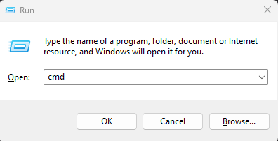
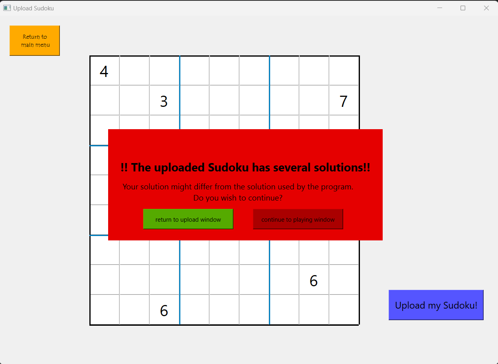

<br />
<div align="center">

<h1 align="center">Sudoku Master</h1>
<p align="center">For sudoku enthusiasts to help make and solve sudokus</p>

</div>


<!-- TABLE OF CONTENTS -->
<details>
  <summary>Table of Contents</summary>
  <ol>
    <li>
      <a href="#about-the-project">About The Project</a>
      <ul>
        <li><a href="#built-with">Built With</a></li>
      </ul>
    </li>
    <li>
      <a href="#getting-started">Getting Started</a>
      <ul>
        <li><a href="#prerequisites">Prerequisites</a></li>
        <li><a href="#installation">Installation</a></li>
      </ul>
    </li>
    <li><a href="#usage">Usage</a></li>
    <li><a href="#features">Features</a></li>
    <li><a href="#license">License</a></li>
    <li><a href="#contact">Contact</a></li>
    <li><a href="#credit">Contact</a></li>
  </ol>
</details>


<!-- ABOUT THE PROJECT -->
## About The Project

Sudoku Master is a sudoku program aimed at aiding individuals grappling with Sudoku challenges. The program is capable of generating and solving Sudoku puzzles with a variery of diffuclties. Users can be helped with solving a sudoku by a built in interactive assistant program, capable of providing users with step-by-step hints for navigating the intricacies of Sudoku problem-solving. Sudoku enthusiasts are also capable of adding notes in cells to help them backtrack when trying to solve a sudoku.

<p align="right">(<a href="#readme-top">back to top</a>)</p>


### Built With

* GitLab
* Visual Studio Code
* PySide6

<p align="right">(<a href="#readme-top">back to top</a>)</p>


<!-- GETTING STARTED -->
## Getting Started

Make sure to gain access to the project on GitLab beforehand and install all necessary modules.

### Prerequisites

**Open command prompt**

In order to open the command prompt and install the necessary modules in order to run the program do the following:

1. Press Windows key + R to open the run command window
2. Type in cmd in the run command window
3. Click on OK to open the command prompt.



**Install all modules**

1. Install PySide6
  ```sh
  py -m pip install PySide6
  ```


### Installation

1. Open the repository in your IDE (preferably Visual Studio Code) using either SSH or HTTPS


2. Open up the copied repository folder in your IDE and run the following command in the terminal

  ```sh
  python setup.py install
  ```

<p align="right">(<a href="#readme-top">back to top</a>)</p>


<!-- USAGE EXAMPLES -->
## Usage

In order to start the application run `UI_main.py` in the `project` folder.
From here you will be taken to the main screen of the program from which you can navigate to all features the program has to offer. The available features and how to navigate between them are explained in further detail below.

<p align="right">(<a href="#readme-top">back to top</a>)</p>

<!-- Features -->
## Features

Below are all features that the program offers illustrated as well with explaining the navigation process.

### Home page
From the main screen the user can either choose to `Upload new Sudoku` or to `Generate new Sudoku` by clicking on one of two buttons. We explain what happens after choosing to upload a sudoku below, however when choosing to generate a sudoku the same features for making the sudoku apply after the size selector screen.


### Size selector
If the user chooses `Upload new Sudoku` the following screen will appear where the user can choose from 3 sudoku sizes to upload (`4x4`, `9x9`, `16x16`). As well as 3 types of sudokus (`Standard`, `Diagonal`, `Chess`)


If the user chooses `Generate new Sudoku` the following screen will appear where the user can choose from 2 sudoku sizes to upload (`4x4`, `9x9`). As well as 3 difficulty levels (`easy`, `normal`, `hard`). Depending on the chosen settings the sudoku can take a little while to generate.


### Uploading sudoku
When a user choses to upload a sudoku instead of generate and choses their size and type, the user can fill in the starting numbers of the sudoku they want to upload.

  

A special upload grid has been made for when the user choses the `Diagonal` type of sudoku


When filling in the starting numbers the user can press `Upload my Sudoku!`


If the user tries to upload a sudoku that has no unique solution they will be notified of this via a pop up message. They can then chose to change their sudoku or continue to play.



### Making the sudoku

The user can start making the sudoku by filling in the cells.


#### Check mistakes

The user can check if any mistakes have been made by pressing `Any Mistakes?` once, and check where the mistake has been made by pressing `Any Mistakes?` again.


#### Getting solution
The user can get the solution of the sudoku by pressing `Show Solution`


#### Getting hints
The user can get a hint when stuck on solving the sudoku by pressing one of hint buttons (`Gidden Single`, `Hidden Pair`, `Naked Pair`, `Pointing Pair`, `Box/Line Reduction`) that work with the different corresponding algorithms for retreiving the hints.


If the chosen algorithm cannot provide a hint at a particular stage in the sudoku the user will be notified with a pop up message.


#### Information screen
The user can press `information` to be provided with a screen that explains the rules of sudoku and how these hint algorithms work so the user can be educated on sudoku solving.


#### Adding notes
The user can add notes to cells in the sudoku so they can keep track of how to solve it by pressing `Notes Off` which in term turns into `Notes On` and entering notes to cells while in this mode. To turn back to solving the sudoku press `Notes on` again to turn them off.


<!-- LICENSE -->
## License

Distributed under the MIT License. See `LICENSE.txt` for more information.

<p align="right">(<a href="#readme-top">back to top</a>)</p>


<p align="right">(<a href="#readme-top">back to top</a>)</p>


<!-- Credit -->
## Credit

* [https://github.com/othneildrew/Best-README-Template] used under the MIT license

<p align="right">(<a href="#readme-top">back to top</a>)</p>
